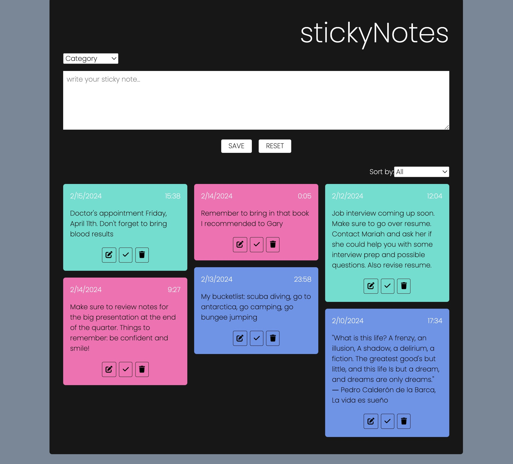
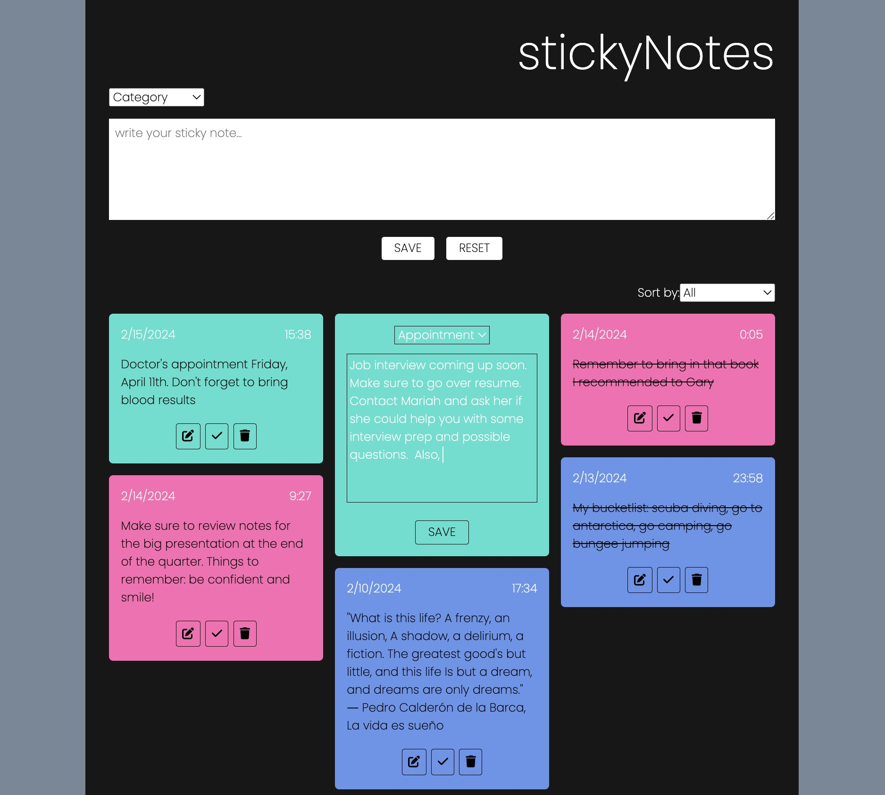

# stickyNotes

stickyNotes is a CRUD app that allows users to write and organize their notes based on color-coded categories.  

<center>
<p float="left">


</p>
</center>

## Table of contents

- [Description](#description)
- [Links](#links)
- [Built With...](#built-with)
- [Continued development](#continued-development)
- [API](#api)
  - [Routes](#routes)
  - [Notes](#notes)
- [Installation Instructions](#installation-instructions)

## Description

stickyNotes is a fullstack app that I'm really proud of.  I tried to put a bit of a spin on the usual notes or reminders app and created this app.  I love visualizing what I have to do by writing each task on a sticky note and posting it on my wall.  From this practice - I created this app.  

Once the list of notes is generated, the notes can be edited in place (including changing the category), crossed off as finished (which makes the note move to the bottom of the list), or deleted entirely. Additionally, the notes can be filtered to only view those within a certain category.

This project was originally just a frontend app, but I went back and created an accompanying backend after learning tools such as Neon and Drizzle.

The frontend and backend are in a monorepo and have been deployed separately using Vercel.  

## Links

Frontend:
https://stickynotes-fullstack.vercel.app/

Backend:
https://stickynotes-server.vercel.app/

## Built with

Frontend:

- HTML
- CSS
- JavaScript
- React.js
- Vite

Backend:

- Node.js
- Express.js
- PostgresSQL
- Neon database
- Drizzle ORM

## What I learned

This app was a review of CRUD functionality. Something that posed a bit of a challenge when creating this project was editing a note in place. It was very easy to render the notes' information in the original form, but I wanted to make sure that the note could be edited right where it was. This posed two issues: creating a new state and value for an editedNote as well as figuring out how to create a textarea that would render the text, so the card stayed the same dimensions. Though my fix for the latter may not be the most accurate, it does work, and I am happy with the results.

I had a really great experience creating the backend for this project.  Although previously my main interest was not in backend development, I enjoyed the process and enjoyed learning about new technologies such as Neon for my database and Drizzle ORM.  I love how calculated backend development is and the step-by-step process that is followed when creating middleware.

The most challenging part of the development was connecting my frontend and backend and getting it deployed. In the end, I combined my backend app.js and server.js files - which I would prefer to have them separate.  

## Continued development

✅ ~~The first thing that I could do to further this project is creating a database so that the notes would be saved and not lost upon refresh.~~ 

To further this aspect, I could even add authentication so that a user would have their own database they could log in to and revisit.

As much as I love CSS, my design skills could always use some improvement. So, adding more CSS and some media-queries to make this more responsive is another way to continue development on this project.

## API

### Routes

| Method   | Route        | Description                                  |
| -------- | ------------ | -------------------------------------------- |
| `GET`    | `/notes`     | List all notes (returned in id order)        |
| `POST`   | `/notes`     | Create a new notes                           |
| `GET`    | `/notes/:id` | Retrieve one note with matching ID date.     |
| `PATCH`  | `/notes/:id` | Update the isCompleted field                 |
| `PUT`    | `/notes/:id` | Update the text or category of the note      |
| `DELETE` | `/notes/:id` | Delete the note that matches the provided ID |

### Notes

Each note contains the following fields:

- `id`: (Primary Key)
- `category`: (String) The category to which the note relates
- `text`: (String) The body of the note
- `completed`: (Boolean) Whether or not the note has been completed
- `createdAt`: (Time) the date/time the note was first created

```javaScript
{
    "id": 2,
    "category": "work",
    "text": "E-mail my boss my hours for the week",
    "completed": false,
    "createdAt": "2024-03-14T14:51:43.990Z"
}
```

## Installation Instructions

1. Fork and clone repository.
2. Run commands from root directory:
3. `cp ./backend/.env.sample ./back-end/.env`
4. `cp ./frontend/.env.sample ./front-end/.env`
5. Edit `./backend/.env` with URL to database.
6. Run `cd frontend && npm install` to install frontend dependencies.
7. Run `cd ..backend && npm install` to install backend dependencies.
8. Run `npm run dev` in main directory to start project in dev mode or `npm run dev` in subdirectory to start only frontend or backend
